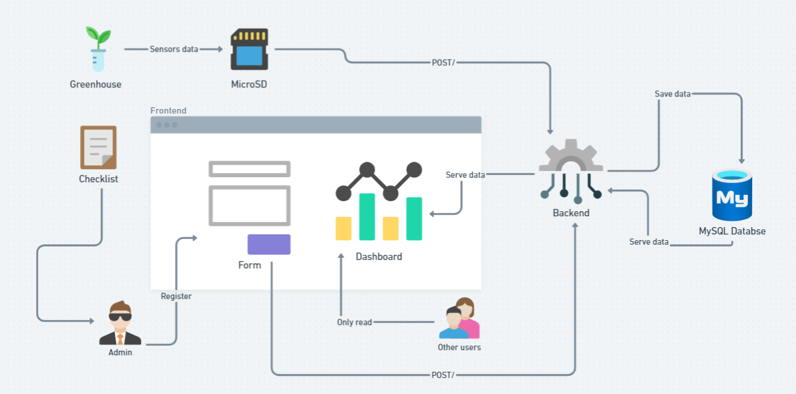
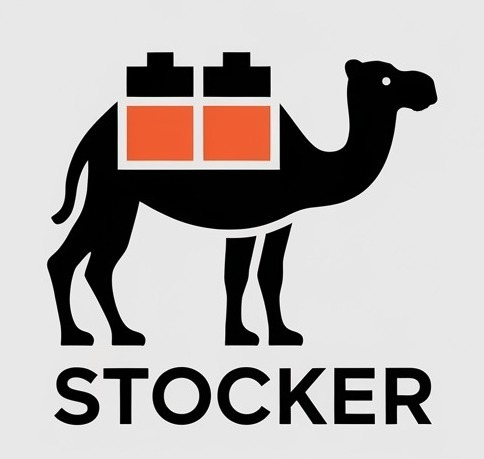
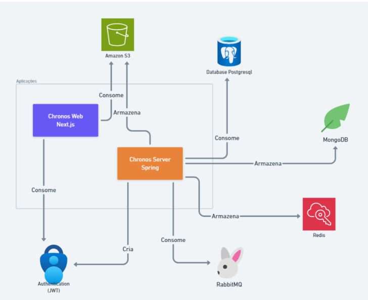
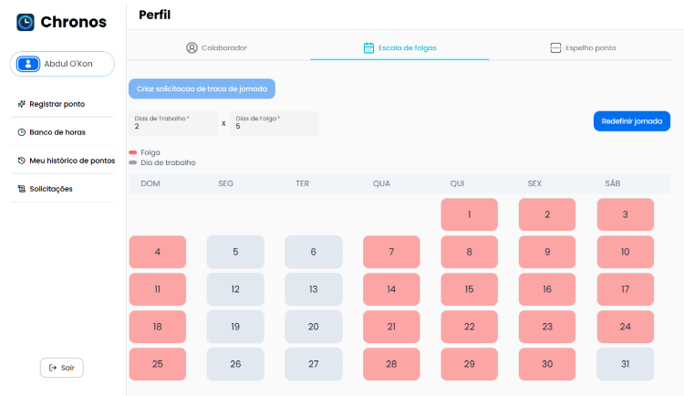

<h1>Kauan Fonseca</h1>

Sou estudante de Desenvolvimento de Software Multiplataforma e competidor em maratonas de programação. Estas são minhas experiências na Fatec SJC.

<h2>Sumário</h2>

◻️ <a href="#sobre-mim">Sobre mim</a>

◻️ <a href="#meus-projetos">Meus Projetos</a>

<ul><a href="#smartfarming">1º Semestre • 1/2024 • Smart Farming</a>
  

    
Detalhes

    <ul>◻️ <a href="#arquitetura-do-projeto">Arquitetura do Projeto</a></ul>
    <ul>◻️ <a href="#prévia-da-solução">Prévia da Solução</a></ul>
    <ul>◻️ <a href="#tecnologias-utilizadas">Tecnologias Utilizadas</a></ul>
    <ul>◻️ <a href="#contribuições-pessoais">Contribuições Pessoais</a></ul>
    <ul>◻️ <a href="#lições-aprendidas">Lições Aprendidas</a>
    <ul>◻️ <a href="#hard-skills">Hard Skills</a></ul>
    <ul>◻️ <a href="#hard-skills">Soft Skills</a></ul>
    </ul>
  

</ul>

<ul><a href="#stocker">2º Semestre • 2/2024 • Stocker</a>
  

    
Detalhes

    <ul>◻️ <a href="#prévia-da-solução-">Prévia da Solução</a></ul>
    <ul>◻️ <a href="#tecnologias-utilizadas-">Tecnologias Utilizadas</a></ul>
    <ul>◻️ <a href="#contribuições-pessoais-">Contribuições Pessoais</a></ul>
    <ul>◻️ <a href="#lições-aprendidas-">Lições Aprendidas</a>
    <ul>◻️ <a href="#hard-skills-">Hard Skills</a></ul>
    <ul>◻️ <a href="#hard-skills-">Soft Skills</a></ul>
    </ul>
  

</ul>

<ul><a href="#chronos">3º Semestre • 1/2025 • Chronos</a>
  

    
Detalhes

    <ul>◻️ <a href="#arquitetura-do-projeto--">Arquitetura do Projeto</a></ul>
    <ul>◻️ <a href="#prévia-da-solução--">Prévia da Solução</a></ul>
    <ul>◻️ <a href="#tecnologias-utilizadas--">Tecnologias Utilizadas</a></ul>
    <ul>◻️ <a href="#contribuições-pessoais--">Contribuições Pessoais</a></ul>
    <ul>◻️ <a href="#lições-aprendidas--">Lições Aprendidas</a>
    <ul>◻️ <a href="#hard-skills--">Hard Skills</a></ul>
    <ul>◻️ <a href="#hard-skills--">Soft Skills</a></ul>
    </ul>
  

</ul>

<h2>Sobre mim</h2>

Mestre em Engenharia de Sistemas Agrícolas pela Universidade de São Paulo (USP), bacharel em Engenharia Agrícola e Ambiental 
pela Universidade Federal de Mato Grosso (UFMT) e regularmente matriculado no 6º semestre do curso tecnólogo em Banco de Dados pela Faculdade de 
Tecnologia de São José dos Campos (FATEC).

Possuo experiência na área de Tecnologia. Durante esse período, tive a oportunidade de desenvolver sistemas inteligentes 
e modelos matemáticos em parceria com o Departamento de Agricultura dos Estados Unidos (USDA). Trabelhei com Gestão de Projetos e Portfólio nas áreas 
de Supply Chain Technology e Construção Civil. Além disso, atuei em análise e governança de dados em system reliability e data quality.

Atualmente sou analista de tecnologia financeira na Johnson & Johnson, trabalho com Digital Transformation, 
automatizando processos na área com ferramentas low-code (Power Platform), em desenvolvimento como especialista na plataforma Anaplan 
e atuando como product owner na implementação de metodologia ágil para o time de suporte de finanças e em projetos de business intelligence junto ao 
departamento jurídico.

• <a href="https://www.linkedin.com/in/guilhermeftavares/">LinkedIn</a> • <a href="https://github.com/guiftavares">GitHub</a> •

<h2>Meus Projetos</h2>
<h3 id="smartfarming">Smart Farming</h3>
<h4>1º Semestre • 1/2024  • <a href="hhttps://github.com/CtrI-Alt-Del/smart-farming">Repositório Github</a> </h4>

Parceiro Acadêmico: <a href="https://fatecsjc-prd.azurewebsites.net/">Faculdade de Tecnologia de São José dos Campos</a>

</img>

Smart Farming é um site web que visa facilitar o trabalho de monitoramento da estufa inteligente de mesmo nome mantida dentro da FATEC de São José dos Campos.

 
<h3>Arquitetura do Projeto</h3>

</img>

 
<h3>Prévia da Solução</h3>

A partir dos objetivos propostos, o aplicativo foi dividido em tres funcionalidades: gerenciamento dos sensores,checklist e plantas

No <b>Gerenciamento de Sensores</b>, o usuário pode deletar, editar e visualizar dados captados automaticamente pelos sensores ou inseri-los manualmente tambem com a opcao de importa-los via CSV. Também é possível visualizá-los em um dashboard interativo que contem 4 graficos. Os dados em questão referem-se à umidade do ar (%), umidade do solo (%), temperatura (°C) e volume de água (mL).

  
<b>Gerenciamento de Sensores</b>

   
      

      

      

Já no <b>Gerenciamento de Checklist</b>, o usuário pode registrar dados a partir de um formulário mantido internamente, além de editá-los, deletá-los, importá-los via arquivo CSV e visualizá-los em uma tabela paginada.

  

  
<b>Gerenciamento Checklist</b>

   
  

  

 

Por fim, no <b>Gerenciamento de Plantas</b>, é possível administrar diversas plantas dentro da estufa, sendo capaz de criar uma planta, editá-la, desativá-la e listá-las.

  
<b>Gerenciamento de Plantas</b>

   
      

      

 
<h3>Tecnologias Utilizadas</h3>

<b><a href="https://flask.palletsprojects.com/">Flask</a>:</b> utilizado para a criação do servidor da aplicação.
 

<b><a href="https://www.docker.com/">Docker</a>:</b> utilizado para a dockerização do banco de dados e do servidor.
 

<b><a href="https://developer.mozilla.org/en-US/docs/Web/HTML">HTML</a>:</b> utilizado na criação dos templates da aplicação web.
 

<b><a href="https://developer.mozilla.org/en-US/docs/Web/JavaScript">JavaScript</a>:</b> utilizado para adicionar reatividade à interface web.

<b><a href="https://apexcharts.com/">ApexCharts</a>:</b> biblioteca utilizada para a criação dos gráficos interativos.
 

<b><a href="https://www.figma.com/">Figma</a>:</b> utilizado para o desenvolvimento e a prototipação das wireframes.

 
<h3>Contribuições Pessoais</h3>

Atuei como Scrum Master, sendo responsável pelo gerenciamento dos processos da equipe e pela remoção de impedimentos ao longo do desenvolvimento. Além disso, contribuí no desenvolvimento do servidor e na integração entre o backend e a aplicação web. As principais atividades desempenhadas foram:

<ul> 
  <li>Gerenciamento dos processos da equipe durante o desenvolvimento</li>
  <li>Identificação e remoção de impedimentos que afetavam o progresso do time</li>
  <li>Integração das funcionalidades dos sensores na interface web</li>
  <li>Desenvolvimento da funcionalidade de gerenciamento de sensores no backend</li>
</ul>
 
<h3>Lições Aprendidas</h3>

Neste semestre, tive meu primeiro contato com a metodologia Scrum, atuando como Scrum Master, além de iniciar minha jornada na programação. Durante esse período, aprendi muito sobre desenvolvimento de software, suas arquiteturas e a dinâmica de trabalho em equipe dentro de projetos. Além disso, percebi que realmente me identifico com a área de tecnologia e que é isso que desejo seguir como carreira.

<h3>Hard Skills</h3>

  
<b>Clique para ver a lista de hard skills</b>

   
  <table align="center">
    <tr>
      <th width="300px">Tecnologia/Metodologia</th>
      <th width="300px">Classificação</th>
    </tr>
    <tr>
      <td>Flask / Python</td>
      <td>★★★★★★★★★☆</td>
    </tr>
    <tr>
      <td>Docker</td>
      <td>★★★★★★★★★☆</td>
    </tr>
    <tr>
      <td>HTML</td>
      <td>★★★★★★★★☆☆</td>
    </tr>
    <tr>
      <td>ApexCharts</td>
      <td>★★★★★★★☆☆☆</td>
    </tr>
    <tr>
      <td>Scrum - Scrum Master</td>
      <td>★★☆☆☆☆☆☆☆☆</td>
    </tr>
  </table>

<h3>Soft Skills</h3>

<b>Clique para ver a lista de soft skills</b>

   
  <table align="center">
    <tr>
      <th width="300px">Habilidade</th>
      <th width="300px">Classificação</th>
    </tr>
    <tr>
      <td>Proatividade</td>
      <td>★★★★★★☆☆☆☆</td>
    </tr>
    <tr>
      <td>Autonomia</td>
      <td>★★★☆☆☆☆☆☆☆</td>
    </tr>
    <tr>
      <td>Colaboração</td>
      <td>★★★★★★☆☆☆☆</td>
    </tr>
    <tr>
      <td>Entrega de Resultados</td>
      <td>★★★☆☆☆☆☆☆☆</td>
    </tr>
  </table>

 

<b>Colaboracao:</b> Desenvolvi minha capacidade de trabalhar em um grupo ao todo 

 

<a href="#sumário">Voltar para o início</a>

<h3 id="stocker">Stocker</h3>
<h4>2º Semestre • 2/2024 • <a href="https://github.com/CtrI-Alt-Del/stocker">Repositório Github</a></h4>

Parceiro Acadêmico: <a href="https://fatecsjc-prd.azurewebsites.net/">Faculdade de Tecnologia de São José dos Campos</a>

</img>

Stocker é uma aplicação que visa facilitar o gerenciamento de estoque, oferecendo funcionalidades de controle (adição, edição e remoção) de produtos armazenados, assim como a visualização e acompanhamento das quantidades e detalhes dos itens em estoque

 
<h3>Prévia da Solução </h3>

Com o objetivo de facilitar o gerenciamento de produtos, foi desenvolvida uma interface web que permite o cadastro, edição, exclusão, listagem e desativação de produtos de forma prática e eficiente.

  
<b>Funcionalidade Gerenciamento de Produtos</b>

   
      

      

A fim de automatizar o gerenciamento de estoque, foi criada uma página específica para cada produto, permitindo a realização de transações com base no estoque disponível. Todos os cálculos são executados de forma automática, tornando o processo mais ágil e confiável.

  

  
<b>Gerenciamento de Estoque</b>

   
      

      

      

      

 
<h3>Tecnologias Utilizadas </h3>

<a href="https://www.typescriptlang.org/">TypeScript</a>: Linguagem utilizada no desenvolvimento tanto do front-end quanto do back-end da aplicação.
 

<a href="https://www.fastify.io/">Fastify</a>: Framework web utilizado para a construção do servidor da aplicação, oferecendo alta performance e baixo consumo de recursos.
 

<a href="https://www.prisma.io/">Prisma</a>: ORM (Object-Relational Mapping) utilizado para facilitar as interações com o banco de dados.
 

<a href="https://nextjs.org/">Next.js</a>: Framework baseado em React utilizado para o desenvolvimento da aplicação web, com foco em performance e renderização híbrida.
 

<a href="https://supabase.com/">Supabase</a>: Plataforma utilizada para hospedar o banco de dados PostgreSQL, oferecendo uma alternativa open-source ao Firebase.

 
<h3>Contribuições Pessoais </h3>

Atuei como membro do Scrum Team, desempenhando o papel de desenvolvedor front-end e contribuindo ativamente para o design e a prototipação do sistema. As principais atividades realizadas foram:

<ul>
  <li>Criação de interfaces com foco em UX/UI design.</li>
  <li>Prototipação de wireframes para definição e validação das telas do sistema.</li>
  <li>Implementação do módulo de gerenciamento de usuários no front-end.</li>
  <li>Implementação do módulo de controle de estoque no front-end.</li>
  <li>Desenvolvimento da funcionalidade de autenticação (login) no front-end.</li>
</ul>
 
<h3>Lições Aprendidas </h3>

Tive meu primeiro contato com React e TypeScript, o que me proporcionou uma base sólida no desenvolvimento de interfaces modernas e tipadas. Além disso, aprofundei meus conhecimentos sobre arquitetura de projetos e padrões de programação, estudando conceitos como Clean Architecture e os princípios SOLID.

<h3>Hard Skills </h3>

  
<b>Clique para ver a lista de hard skills</b>

   
  <table align="center">
    <tr>
      <th width="300px">Tecnologia/Metodologia</th>
      <th width="300px">Classificação</th>
    </tr>
    <tr>
      <td>Typescript</td>
      <td>★★★★★★★★☆☆</td>
    </tr>
    <tr>
      <td>NextJS</td>
      <td>★★★★★★★★☆☆</td>
    </tr>
    <tr>
      <td>Padrões de programação</td>
      <td>★★★★★★★★★☆</td>
    </tr>
    <tr>
      <td>Figma</td>
      <td>★★★★★★☆☆☆☆</td>
    </tr>
    <tr>
      <td>UX/UI design</td>
      <td>★★★☆☆☆☆☆☆☆</td>
    </tr>
  </table>

<h3>Soft Skills </h3>

<b>Clique para ver a lista de soft skills</b>

   
  <table align="center">
    <tr>
      <th width="300px">Habilidade</th>
      <th width="300px">Classificação</th>
    </tr>
    <tr>
      <td>Proatividade</td>
      <td>★★★★★★★★☆☆</td>
    </tr>
    <tr>
      <td>Autonomia</td>
      <td>★★★★★★★★★☆</td>
    </tr>
    <tr>
      <td>Colaboração</td>
      <td>★★★★★★★☆☆☆</td>
    </tr>
    <tr>
      <td>Entrega de Resultados</td>
      <td>★★★★★★★★☆☆</td>
    </tr>
  </table>

 

<b>Autonomia:</b> Por haver poucas pessoas envolvidas no desenvolvimento do front-end, precisei assumir um alto nível de autonomia para definir o que entregar e como entregar. Isso me impulsionou significativamente nos estudos e na evolução prática das minhas habilidades.
 
 

 

<a href="#sumário">Voltar para o início</a>

<h3>Chronos</h3>
<h4>3º Semestre • 1/2025 • <a href="https://github.com/CtrI-Alt-Del/chronos">Repositório Github</a></h4>

Parceiro Acadêmico: <a href="https://necto.com.br/pt/">Necto Systems</a>

Chronos é uma aplicação web que simplifica o gerenciamento de ponto online, oferecendo funcionalidades completas para controle de jornada de trabalho. Permite o registro de ponto online, cálculo automático de horas, gestão de ausências e geração de relatórios detalhados. 

<h3>Arquitetura do Projeto  </h3>

</img>

 
<h3>Prévia da Solução  </h3>

A aplicação conta com as seguintes funcionalidades principais: gerenciamento de ponto, jornadas de trabalho,solicitações de colaboradores e banco de horas.

Na funcionalidade de gerenciamento de ponto, o usuário pode registrar seus horários de entrada e saída. Caso possua as permissões adequadas, também pode alterar os horários registrados. Se necessário, é possível criar uma solicitação para correção ou troca de ponto.

  

  
<b>Batida de Ponto</b>

   
  

  

 
Na funcionalidade de jornada, o colaborador pode visualizar sua jornada de trabalho definida, enquanto o gerente tem permissão para alterar os dias da jornada, permitindo montar uma escala fixa mensal. Além disso, é possível registrar períodos de férias, quando necessário.

  
<b>Jornada de trabalho</b>

   
  
    

Na funcionalidade de solicitações, o colaborador pode realizar diversos pedidos, como afastamento, troca de ponto, férias ou abono de falta. Cabe ao gestor analisar e decidir pela aprovação ou reprovação dessas solicitações.
 
  

  
<b>Gereciamento de solicitações</b>

   
  
   

Por fim, a funcionalidade de banco de horas permite que o colaborador visualize seu saldo atual, enquanto o gerente pode realizar transações de crédito ou débito, conforme necessário.

  

  
<b>Banco de Horas</b>

   
  

 
<h3>Tecnologias Utilizadas  </h3>

<b><a href="https://spring.io/">Spring Boot</a>:</b> utilizado no desenvolvimento do servidor backend.
 

<b><a href="https://www.typescriptlang.org/">TypeScript</a>:</b> linguagem utilizada no desenvolvimento do front-end da aplicação.
 

<b><a href="https://nextjs.org/">Next.js</a>:</b> framework utilizado para a construção da aplicação web.
 

<b><a href="https://www.postgresql.org/">PostgreSQL</a>:</b> sistema de gerenciamento de banco de dados relacional (SGBD) utilizado na persistência de dados.
 

<b><a href="https://www.atlassian.com/software/jira">Jira</a>:</b> ferramenta utilizada para a gestão do projeto com a metodologia Scrum.
 

<b><a href="https://www.mongodb.com/">MongoDB</a>:</b> banco de dados não relacional utilizado para o armazenamento do banco de horas.
 

<b><a href="https://redis.io/">Redis</a>:</b> banco de dados em memória utilizado para cache do servidor.
 

<b><a href="https://www.rabbitmq.com/">RabbitMQ</a>:</b> ferramenta de gerenciamento de filas, utilizada para comunicação assíncrona entre serviços.

 
<h3>Contribuições Pessoais  </h3>

Desempenhei o papel de Scrum Team e atuei como desenvolvedor full-stack, com foco principal no backend. Além disso, contribuí ativamente para o desenvolvimento da arquitetura da aplicação.As principais atividades foram:

<ul> <li>Desenvolvimento do sistema de autenticação no backend</li> <li>Implementação do gerenciamento de solicitações no backend e frontend</li> <li>Definição e estruturação da arquitetura da aplicação</li> <li>Desenvolvimento do gerenciamento de colaboradores no backend e frontend</li> <li>Geração de relatórios com gráficos no backend</li> </ul>
 
<h3 id="lições-aprendidas--">Lições Aprendidas </h3>

Tive meu primeiro contato com o Spring Boot, e ao longo do projeto consegui aprimorar significativamente minha atuação como desenvolvedor full-stack, desenvolvendo tanto minhas hard skills quanto minhas soft skills.

<h3>Hard Skills  </h3>

  
<b>Clique para ver a lista de hard skills</b>

   
  <table align="center">
    <tr>
      <th width="300px">Tecnologia/Metodologia</th>
      <th width="300px">Classificação</th>
    </tr>
    <tr>
      <td>Spring Boot</td>
      <td>★★★★★★★★☆☆</td>
    </tr>
    <tr>
      <td>TypeScript</td>
      <td>★★★★★★★★☆☆</td>
    </tr>
    <tr>
      <td>NextJs</td>
      <td>★★★★★★★★☆☆</td>
    </tr>
    <tr>
      <td>PostgresSQL</td>
      <td>★★★★★☆☆☆☆☆</td>
    </tr>
    <tr>
      <td>MongoDB</td>
      <td>★★☆☆☆☆☆☆☆☆</td>
    </tr>
    <tr>
      <td>Jira</td>
      <td>★★☆☆☆☆☆☆☆☆</td>
    </tr>
    <tr>
      <td>RabbitMQ</td>
      <td>★★★★★★★★☆☆</td>
    </tr>
  </table>

<h3>Soft Skills  </h3>

<b>Clique para ver a lista de soft skills</b>

   
  <table align="center">
    <tr>
      <th width="300px">Habilidade</th>
      <th width="300px">Classificação</th>
    </tr>
    <tr>
      <td>Proatividade</td>
      <td>★★★★★★★★☆☆</td>
    </tr>
    <tr>
      <td>Autonomia</td>
      <td>★★★★★★★★☆☆</td>
    </tr>
    <tr>
      <td>Colaboração</td>
      <td>★★★★★★★★☆☆</td>
    </tr>
    <tr>
      <td>Entrega de Resultados</td>
      <td>★★★★★★★★★☆</td>
    </tr>
  </table>

 

<b>Entrega de Resultados:</b> Devido à baixa quantidade de colaboradores atuando no backend, assumi uma carga maior de responsabilidades nessa área. Isso me proporcionou um aprendizado acelerado e um aprimoramento significativo das minhas habilidades técnicas.

 

 

<a href="#sumário">Voltar para o início</a>

